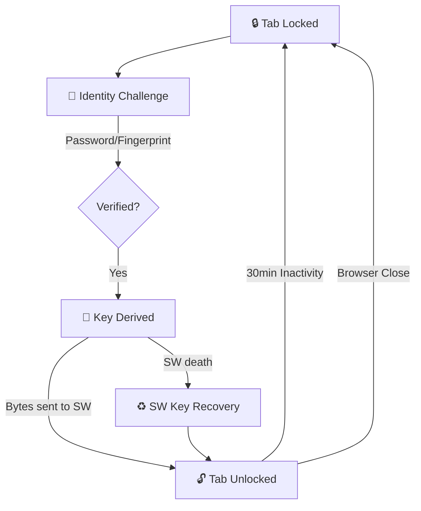

# 🛡 StealthTab: Master Developer Guide

Welcome to the **StealthTab** codebase. This document is a comprehensive architectural guide designed to take you from a curious newbie to an expert contributor. It explains not just *what* the code does, but *why* it was built this way.

---

## 🎯 1. High-Level Mission
StealthTab is a "Private Tab Cloaking" extension. Its job is to take a sensitive website (e.g., a bank login or a personal project) and instantly hide it behind a harmless "decoy" website (e.g., Google or LinkedIn) the moment you're not looking. To see the real content again, you must authenticate via Password or Fingerprint.

---

## 🏗 2. Architectural Structure (The 4 Pillars)

StealthTab is divided into four main functional areas:

### 🧠 A. The Service Worker (The Brain)
- **File**: `background/service-worker.js`
- **Role**: It is the global orchestrator. It runs in the background even when the popup is closed.
- **Key Responsibilities**:
    - **Session Key Management**: It holds the AES-256-GCM `CryptoKey` in memory only. It never saves this key to disk.
    - **Navigation Guard**: It listens to `webNavigation.onCommitted`. If a "Locked" tab tries to navigate away from its decoy (e.g., if you press the back button), the SW instantly forces it back to the decoy.
    - **Inactivity Timer**: It tracks user activity and re-locks tabs after 30 minutes of silence.
    - **Icon Manager**: It dynamically draws the toolbar icons (Shield with Lock/Unlock) using `OffscreenCanvas`.

### 🎛 B. The Popup (The Manager)
- **File**: `popup/popup.js`
- **Role**: The setup wizard and tab management dashboard.
- **Key Responsibilities**:
    - **Setup Wizard**: Guides the user through selecting tabs, choosing decoys, and setting up auth.
    - **Tab Selection**: Uses `chrome.tabs.query` to find all current windows and filter out system pages.
    - **Biometric Enrollment**: Handles the high-stakes `WebAuthn` registration logic.

### 🚪 C. The Auth Page (The Gatekeeper)
- **File**: `auth/auth.js`
- **Role**: The full-page "Locked" screen that appears when you try to view a protected tab.
- **Key Responsibilities**:
    - **Identity Verification**: Checks your password or fingerprint.
    - **Decryption**: If valid, it derives the AES key and sends it to the Service Worker to "unlock" the tab.

### 📦 D. Storage Utility (The Vault)
- **File**: `utils/storage.js`
- **Role**: The single source of truth for persistent data.
- **Key Responsibilities**:
    - Stores the encrypted URLs, decoy URLs, and biometric metadata.
    - Ensures all keys are whitelisted before writing to `chrome.storage.local`.

---

## 🔐 3. Security Model & Data Flow

### 3.1 The "Identity vs. Encryption" Paradox
1. **Password Mode**: Your password is the *actual* source of the encryption key. We use PBKDF2 (310,000 iterations) to turn your password + a unique salt into a strong AES-256-GCM key.
2. **Biometric Mode**: In a browser extension, a fingerprint *cannot* directly generate a deterministic AES key. 
3. **The Solution**: Biometrics prove **WHO** you are. Once the fingerprint is accepted, we retrieve the `backupPassword` from the volatile `chrome.storage.session` memory and derive the key. 

### 3.2 Unlock State Flow (Visual)

### 3.3 Threat Model
To properly evaluate StealthTab, we define what it **is** and **is not** designed to protect against:

| Protects Against | NOT Protected Against |
| :--- | :--- |
| **Shoulder Surfing**: Casual observers seeing sensitive URLs. | **OS-Level Compromise**: Keyloggers or malware on the OS. |
| **Opportunistic Access**: A coworker using your unlocked browser. | **Extension Debugging**: An expert user with DevTools access. |
| **Shared-System Exposure**: Family members seeing private tabs. | **Memory Inspection**: Advanced forensic memory dumps. |
| **History Recovery**: Casual URL recovery from browser history. | **Physical Hardware Theft**: Access to un-encrypted disk sectors. |

### 3.4 Session Lifecycle & SW Warning
**CRITICAL**: Chrome extensions unload Service Workers automatically after ~30 seconds of idleness. 
- StealthTab stores its master `CryptoKey` in the **Service Worker Memory**.
- When the SW unloads, the key is destroyed.
- **Persistence Strategy**: We sync the key bytes to `chrome.storage.session` (memory-resident). This allows the SW to "wake up" and restore the session without re-prompting you for a password.
- **Browser Close**: Closing the browser wipes all `session` storage, creating a permanent "Hard Lock."

### 3.5 Storage Contract
| Location | Data Stored | Persistence |
| :--- | :--- | :--- |
| `chrome.storage.local` | Encrypted URLs, Salts, Decoy Prefs. | Permanent (on disk) |
| `chrome.storage.session` | Active AES Key Bytes, Backup Password. | Volatile (RAM only) |
| **Service Worker RAM** | Active `CryptoKey` object. | Volatile (Transient) |
| **Content Script** | **NONE** (Never touches secrets). | N/A |

---

## 🛠 4. Developer FAQ & Troubleshooting

### Q: Why do we use `importScripts` in the Service Worker?
A: In Manifest V3, Service Workers cannot use `<script>` tags. We use `importScripts` to bring in our `storage.js` and `crypto.js` utilities.

### Q: How do we prevent the "Back Button" from revealing the real URL?
A: The `webNavigation.onCommitted` listener in the SW catches the navigation *before* the DOM loads. It checks if the tab is `locked` and if the new URL is NOT the decoy.

### Q: What happens if the extension is re-installed?
A: `onInstalled` triggers a `chrome.storage.local.clear()`. This ensures no stale/encrypted data is left behind.

---

## 🚀 5. Getting Started as a Newbie
1. **Read `manifest.json`**: Understand the permissions (tabs, storage, webNavigation).
2. **Setup the Popup**: Open `popup.js` and follow the `completeSetup()` logic to see how storage is initialized.
3. **Watch the Service Worker**: Add `console.log` in `handleMessage` to see the traffic between the popup and the background.

Happy Coding! 🔒
